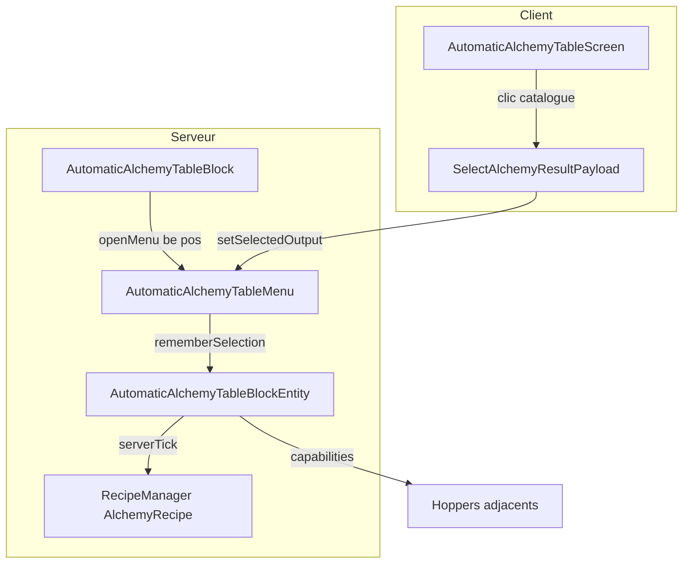

# Table d'alchimie automatique — note technique

Branche : `automatic-block`  
Id bloc : `tablemod:automatic_alchemy_table`

Ce document décrit ce qui a été ajouté au mod, comment les pièces s'articulent, et le comportement côté serveur (craft, hoppers, persistance).

---

## Objectif

Automatiser la transmutation de la **table d'alchimie manuelle** sans dupliquer la logique de recette : le bloc réutilise `AlchemyRecipe`, `AlchemyRecipeInput` et le type `tablemod:alchemy` déjà existants.

Le joueur choisit une **cible** (item de sortie) dans une GUI calquée sur la table classique ; les **hoppers** gèrent l'approvisionnement et l'évacuation des items.

---

## Fichiers ajoutés

| Rôle | Chemin |
|------|--------|
| Bloc (pose, LIT, ouverture GUI) | `block/custom/AutomaticAlchemyTableBlock.java` |
| Block entity (inventaire, tick, craft, hoppers) | `block/entity/AutomaticAlchemyTableBlockEntity.java` |
| Menu conteneur | `menu/AutomaticAlchemyTableMenu.java` |
| Écran client (catalogue, recherche) | `screen/AutomaticAlchemyTableScreen.java` |
| Blockstates / modèles / loot | `assets/.../automatic_alchemy_table.*`, `data/.../loot_table/...` |
| Recette de craft du bloc | `data/tablemod/recipe/automatic_alchemy_table.json` |

## Fichiers modifiés (enregistrement & intégration)

- `ModBlocks`, `ModBlockEntities`, `ModMenuTypes`, `ModCreativeModTabs`
- `TableMod` (déjà présent pour le mod)
- `ClientModEvents` (écran + `RenderType.cutout()`)
- `SelectAlchemyResultPayload` (prise en charge du menu automatique)
- `en_us.json` (clés de traduction)

---

## Architecture globale

---

## Bloc `AutomaticAlchemyTableBlock`

- Hérite de `HorizontalDirectionalBlock` + `EntityBlock`, comme la table manuelle.
- Propriété `LIT` : allumée si un joueur a la GUI ouverte **ou** si une cible est choisie et le slot d'entrée n'est pas vide.
- `FACING` : défini à la pose (`getHorizontalDirection().getOpposite()`), représente la **face avant** du modèle.
- Clic : sons, compteur `playersUsing` sur le BE, ouverture via `player.openMenu(tableBe, pos)` (évite un `RegistryFriendlyByteBuf` null avec le factory du menu).
- `getTicker` → `AutomaticAlchemyTableBlockEntity.serverTick` côté serveur uniquement.

---

## Block entity — inventaire

`ItemStackHandler` de **3 slots** :

| Index | Constante | Rôle |
|-------|-----------|------|
| 0 | `SLOT_INPUT` | Matière à transmuter (rempli par hopper gauche / tick actif) |
| 1 | `SLOT_CATALYST` | Catalyseur si la recette l'exige (face **haut**) |
| 2 | `SLOT_OUTPUT` | Buffer de sortie (max **1 item**) avant éjection vers hopper droit |

### Sélection persistée (NBT)

- `SelectedRecipeId` : `ResourceLocation` de la recette choisie dans le catalogue (indicatif).
- `SelectedOutput` : `ItemStack` cible (1 item, composants inclus).

La recette **réellement utilisée** au craft est recalculée chaque tick via `findCraftHolder` (voir plus bas) : l'id mémorisé peut être corrigé si l'entrée change.

---

## Orientation & hoppers

Vu depuis la **face avant** (`FACING`) :

| Côté monde | Rôle | Mécanisme |
|------------|------|-----------|
| `facing.getClockWise()` | **Entrée** | Aspiration **active** depuis le conteneur adjacent (`tryPullFromAdjacent`) |
| `facing.getCounterClockWise()` | **Sortie** | Éjection **active** vers le conteneur adjacent (`tryPushToAdjacent`) |
| `UP` | Catalyseur | Aspiration active vers `SLOT_CATALYST` |

### Capabilities (`getItemHandler(Direction side)`)

Enregistré dans `ModBlockEntities.registerCapabilities` sur `Capabilities.ItemHandler.BLOCK`.

Handlers par face via `SingleSlotHandler` (un slot, insert/extract contrôlés) :

- **Entrée** : `insert = true` (filtré par `canAcceptInputFromHopper`), `extract = false` → funnels Create en push et hoppers peuvent déposer ; aucun automate ne retire par cette face.
- **Sortie** : `insert = false`, `extract = true` → un hopper peut aussi **tirer** depuis le buffer de sortie.
- **Haut** : insert + extract pour le catalyseur (comportement classique).

`getAdjacentItemHandler` interroge la capability sur la face opposée (`fromTableTowardNeighbor.getOpposite()`), avec repli `null` si besoin.

### Compatibilité Create (funnels)

Aucune dépendance Create en production : les funnels utilisent la même API `IItemHandler` que les hoppers.

| Face | Funnel Create | Hopper vanilla |
|------|---------------|----------------|
| Gauche (entrée) | Push → `insertItem` filtré **ou** buffer aspiré par la table (8 ticks) | Aspiration active + insert capability |
| Droite (sortie) | Pull → `extractItem` sur le buffer | Éjection active + extract capability |
| Haut (catalyseur) | Push / pull selon mode funnel | Aspiration active + insert/extract |

Branchement recommandé : tapis → funnel push (gauche) → table → funnel pull (droite) → tapis sortie.

Vitesse table : **8 ticks** par transfert ou craft (`HopperBlockEntity.MOVE_ITEM_SPEED`), identique à un hopper.

Pour tester en dev : Create est chargé via `localRuntime` dans `build.gradle` (absent du jar publié et de `neoforge.mods.toml`).

---

## Boucle serveur (`serverTick`)

Ordre **intentionnel** :

1. `resolveSelectionForCurrentInput` — aligne `selectedRecipeId` sur une recette compatible entrée + cible.
2. `tryCraftOne` — au plus **1 transmutation** par tick si conditions OK.
3. `tryTransferWithAdjacentBlocks` :
   - d'abord **push** sortie (droite),
   - puis **pull** entrée (gauche),
   - puis **pull** catalyseur (haut).

Le craft avant le transfert garantit que l'item produit est poussé dès le même tick (ou le suivant si le hopper est plein).

### Aspiration entrée (`tryPullFromAdjacent`)

- Extrait depuis l'`IItemHandler` voisin (simulate puis réel).
- Valide avec `canAcceptInputFromHopper` : l'item doit matcher **au moins une** recette alchimie (`matchesAnyAlchemyInput`), **sans** exiger que la cible GUI soit compatible (l'item peut rester bloqué en entrée sans craft).
- Insertion via `inventory.insertItem(SLOT_INPUT, …)` — **pas** `ItemHandlerHelper.insertItemStacked` sur tout l'inventaire (évite de remplir un mauvais slot).

### Éjection sortie (`tryPushToAdjacent`)

- Copie du stack slot sortie → `ItemHandlerHelper.insertItemStacked` dans le voisin.
- Le reliquat reste dans `SLOT_OUTPUT`.

### Craft (`tryCraftOne`)

Conditions :

1. `hasTargetSelection()` (id + stack cible non vides).
2. `SLOT_OUTPUT` **vide** (buffer limité à 1 item ; la table ne transmute plus tant que le buffer n'est pas vidé).
3. `findCraftHolder(level, input, catalyst, selectedOutput)` non null.
4. `recipe.matches(recipeInput, level)` (entrée + catalyseur si requis).

Effets : −1 entrée, −1 catalyseur si requis, +1 dans `SLOT_OUTPUT` (copie de `selectedOutput`), son `BREWING_STAND_BREW`.

### Résolution de recette (`findCraftHolder`)

Parcourt **toutes** les recettes `tablemod:alchemy` :

- `matchesInputOnly` sur l'entrée actuelle ;
- la cible doit apparaître dans `recipe.getFilteredResults(input, registries)` (même logique que la table manuelle : exclut l'item identique à l'entrée dans une famille).

Ne dépend pas uniquement de `selectedRecipeId` figé au clic GUI — important si le catalogue global affichait une recette incompatible avec l'entrée réelle.

---

## GUI & réseau

### Menu `AutomaticAlchemyTableMenu`

4 slots machine (indexation menu) :

| Index | Position GUI | Contenu | Interaction joueur |
|-------|--------------|---------|--------------------|
| 0 | 20, 54 | `SLOT_INPUT` du BE | Retrait seul (pas de dépôt) |
| 1 | 143, 45 | Aperçu cible (`selectionPreview`) | Lecture seule |
| 2 | 20, 35 | `SLOT_CATALYST` du BE | Retrait seul (pas de dépôt) |
| 3 | 143, 63 | `SLOT_OUTPUT` du BE (1 item max) | Retrait seul (pas de dépôt) |

Inventaire joueur à partir du slot 4.

- `getRecipeHoldersForInput` : filtre les recettes comme `AlchemyTableMenu.updateRecipes` (liste vide d'entrée → toutes les recettes pour le mode « catalogue global »).
- Shift-clic depuis les slots machine → inventaire joueur. Shift-clic depuis l'inventaire joueur n'insère dans aucun slot machine (alimentation uniquement par hopper).

### Écran `AutomaticAlchemyTableScreen`

- Texture partagée : `textures/gui/alchemy_table.png`.
- Grille 4×3, recherche, scrollbar — calqué sur `AlchemyTableScreen`.
- `collectResults()` :
  - **sans** entrée : toutes les sorties de toutes les recettes (`getResults()`),
  - **avec** entrée : uniquement recettes compatibles + `getFilteredResults(input)`.
- Clic → `ModMessages.sendSelectResult` → `SelectAlchemyResultPayload` → `autoMenu.setSelectedOutput` → `blockEntity.rememberSelection`.

### Ouverture

`AutomaticAlchemyTableMenu` factory : `IMenuTypeExtension.create(AutomaticAlchemyTableMenu::new)` + constructeur `(id, inv, level, pos)` pour le serveur quand le buffer réseau est absent.

---

## Enregistrement NeoForge

| Élément | Id registre |
|---------|-------------|
| Bloc | `tablemod:automatic_alchemy_table` |
| Block entity | `tablemod:automatic_alchemy_table` |
| Menu | `tablemod:automatic_alchemy_table_menu` |

Recette de craft JSON : table manuelle + hopper + redstone (voir `data/tablemod/recipe/automatic_alchemy_table.json`).

---

## Différences avec la table manuelle

| Aspect | Table manuelle | Table automatique |
|--------|----------------|-------------------|
| Choix sortie | Recettes filtrées par entrée | Idem si entrée visible ; catalogue global si slot vide |
| Craft | Clic slot résultat (`quickMoveStack`) | Tick serveur automatique |
| Logistique | Joueur | Hoppers + transfert actif |
| Slots GUI | Entrée + catalyseur + résultat | Entrée + catalyseur + sortie (retrait seul) + aperçu cible |
| Persistance cible | Par recette sur BE table | `SelectedRecipeId` + `SelectedOutput` sur BE auto |

---

## Limites connues (données de jeu)

- Une bûche normale (`forge:logs`) ne peut pas devenir une bûche *stripped* : familles de tags différentes (`logs` vs `stripped_logs`), identique à la table manuelle.
- Sans cible choisie dans la GUI, aucun craft automatique (l'entrée peut quand même se remplir).
- Cible incompatible avec l'entrée : pas de craft, l'item reste en slot d'entrée.
- Le buffer de sortie (`SLOT_OUTPUT`) ne contient qu'**1 item** maximum. Tant qu'il est plein (hopper absent ou plein), la table ne transmute plus.

---

## Tests manuels recommandés

1. Poser la table, ouvrir la GUI, choisir une sortie (ex. autre type de bûche).
2. Hopper **gauche** (face avant) → bûches ; hopper **droite** → vide, orienté vers la table.
3. Vérifier : transmutation, sortie dans le hopper droit, pas de retour dans le slot d'entrée ni hopper gauche.
4. Retirer la cible / changer l'entrée : le catalogue GUI doit se filtrer comme sur la table classique.
5. **Slot catalyseur** (haut gauche GUI) : hopper dessus → le catalyseur apparaît. Le joueur peut le retirer mais pas le déposer manuellement.
6. **Slot sortie** (bas droite GUI) : retirer le hopper droit → l'item transmuté reste dans le slot (1 seul). La table ne transmute plus tant que le slot n'est pas vidé. Le joueur peut récupérer l'item manuellement.
7. Shift-clic depuis l'inventaire joueur ne dépose rien dans les slots machine.
8. **Create** : tapis + funnels sur les trois faces — entrée push, sortie pull, catalyseur dessus (recette avec catalyseur).

---

## Références code

- Craft & hoppers : `AutomaticAlchemyTableBlockEntity.java`
- Catalogue client : `AutomaticAlchemyTableScreen.java` + `AutomaticAlchemyTableMenu.getRecipeHoldersForInput`
- Payload sélection : `SelectAlchemyResultPayload.java`
- Filtrage sorties : `AlchemyRecipe.getFilteredResults` dans `AlchemyRecipe.java`
