# La Table - Cheat Sheet des transmutations (1.21.1)

## Regles globales
- Le mod contient actuellement 19 recettes de transmutation.
- Une recette fonctionne toujours a l'interieur d'une famille.
- Un item peut devenir n'importe quel autre item de sa famille.
- L'item deja pose dans la table n'apparait pas dans les sorties.
- Catalyseurs acceptes: Glowstone Dust, Diamond, Bone Meal, Echo Shard, Amethyst Shard.
- Si une famille demande un catalyseur, 1 catalyseur est consomme par transmutation.
- Si une famille ne demande pas de catalyseur, le slot catalyseur peut rester vide.
- Le tag `tablemod:alchemy_fuel` existe, mais il n'est pas reference par les 19 recettes actuelles.

## Lecture rapide
- Color swap avec catalyseur requis: banners, beds, carpets, concrete, concrete powder, shulker boxes.
- Color swap sans catalyseur: glass, glass panes, terracotta, wool.
- Material swap avec catalyseur requis: fences.
- Material swap sans catalyseur: saplings, logs, planks, stripped logs, stone, stone bricks, walls, soul sand -> soul soil.

## Familles de transmutation

### Colored
- `banner`: toute banniere vanilla -> toute autre banniere vanilla. Catalyseur requis.
- `bed`: tout lit vanilla -> tout autre lit vanilla. Catalyseur requis.
- `carpet`: tout carpet de laine -> tout autre carpet de laine. Catalyseur requis.
- `concrete`: tout beton colore -> tout autre beton colore. 16 couleurs. Catalyseur requis.
- `concrete_powder`: toute poudre de beton coloree -> toute autre poudre de beton coloree. 16 couleurs. Catalyseur requis.
- `glass`: verre normal + verres teintes -> toute autre variante du groupe. 17 variantes au total. Catalyseur non requis.
- `glass_panes`: vitre normale + vitres teintes -> toute autre variante du groupe. 17 variantes au total. Catalyseur non requis.
- `shulker_box`: boite shulker normale + boites shulker colorees -> toute autre variante du groupe. 17 variantes au total. Catalyseur requis.
- `terracotta`: terracotta normale + terracottas teintes -> toute autre variante du groupe. 17 variantes au total. Catalyseur non requis.
- `wool`: toute laine coloree -> toute autre laine coloree. 16 couleurs. Catalyseur non requis.

### Wood
- `fence`: oak, spruce, birch, jungle, acacia, dark oak, mangrove, cherry, bamboo, crimson, warped, nether brick fence. 12 variantes. Catalyseur requis.
- `logs`: tout le tag vanilla `#minecraft:logs` -> toute autre entree du meme tag. Catalyseur non requis.
- `planks`: tout le tag vanilla `#minecraft:planks` -> toute autre entree du meme tag. Catalyseur non requis.
- `stripped_logs`: toutes les variantes stripped de logs, woods, stems et hyphae definies dans `forge:stripped_logs`. 20 variantes. Catalyseur non requis.

### Stone
- `stone`: stone, granite, polished granite, diorite, polished diorite, andesite, polished andesite, cobblestone, smooth stone, deepslate, cobbled deepslate, polished deepslate, tuff. 13 variantes. Catalyseur non requis.
- `stone_bricks`: stone bricks, mossy stone bricks, cracked stone bricks, chiseled stone bricks. 4 variantes. Catalyseur non requis.
- `walls`: cobblestone, mossy cobblestone, brick, prismarine, red sandstone, sandstone, granite, diorite, andesite, blackstone, stone brick, mossy stone brick, nether brick, end stone brick, deepslate brick, deepslate tile, mud brick walls. 17 variantes. Catalyseur non requis.

### Nature
- `sapling`: tout le tag vanilla `#minecraft:saplings` -> toute autre entree du meme tag. Catalyseur non requis.

### Nether
- `soul_soil`: soul sand -> soul soil. Conversion directe 1 vers 1. Catalyseur non requis.

## Diagramme

```mermaid
flowchart TD
    T["Alchemy Table"]

    T --> C["Colored"]
    T --> W["Wood"]
    T --> S["Stone"]
    T --> N["Nature"]
    T --> H["Nether"]

    C --> C1["Banners - 16 - catalyst"]
    C --> C2["Beds - 16 - catalyst"]
    C --> C3["Carpets - 16 - catalyst"]
    C --> C4["Concrete - 16 - catalyst"]
    C --> C5["Concrete Powder - 16 - catalyst"]
    C --> C6["Glass - 17 - no catalyst"]
    C --> C7["Glass Panes - 17 - no catalyst"]
    C --> C8["Shulker Boxes - 17 - catalyst"]
    C --> C9["Terracotta - 17 - no catalyst"]
    C --> C10["Wool - 16 - no catalyst"]

    W --> W1["Fences - 12 - catalyst"]
    W --> W2["Logs - vanilla tag - no catalyst"]
    W --> W3["Planks - vanilla tag - no catalyst"]
    W --> W4["Stripped Logs - 20 - no catalyst"]

    S --> S1["Stone - 13 - no catalyst"]
    S --> S2["Stone Bricks - 4 - no catalyst"]
    S --> S3["Walls - 17 - no catalyst"]

    N --> N1["Saplings - vanilla tag - no catalyst"]
    H --> H1["Soul Sand -> Soul Soil"]
```

## Pense-bete gameplay
- Si tu veux recolorer un bloc ou item, regarde d'abord dans `Colored`.
- Si tu veux changer de famille de bois, regarde `Wood`.
- Si tu veux permuter des variantes minerales, regarde `Stone`.
- Si tu veux une conversion speciale hors cycle, le seul cas actuel est `Soul Sand -> Soul Soil`.
- Pour toutes les familles cycliques, la logique est: `1 entree -> toutes les autres sorties de la meme famille`.
